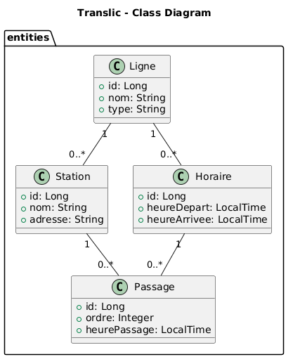

# Translic

Application backend Spring Boot pour la gestion de transports publics, avec une vue frontend simple pour tester les fonctionnalités.


## Diagramme UML

Diagramme de classes du projet :




## Aperçu

Le projet expose une API REST autour de 4 entités principales :

- `Ligne`
- `Station`
- `Horaire`
- `Passage`

Architecture en couches :

- `controllers` : endpoints REST
- `services` + `services/impl` : logique métier
- `repositories` : accès base de données (Spring Data JPA)
- `entities` : modèle de données
- `dto` : objets de requête + validation
- `exceptions` : gestion centralisée des erreurs

## Stack technique

- Java 17
- Spring Boot
  - Spring Web MVC
  - Spring Data JPA
  - Spring Validation
- MySQL (runtime)
- Lombok
- Maven

## Prérequis

- Java 17+
- Maven (ou `mvnw`)
- MySQL en local (par défaut)

## Configuration

Le fichier `src/main/resources/application.properties` contient :

- Port API : `8080`
- Datasource MySQL via variables d'environnement :
  - `DB_URL` (par défaut : `jdbc:mysql://localhost:3306/translic_db?createDatabaseIfNotExist=true`)
  - `DB_USERNAME` (par défaut : `root`)
  - `DB_PASSWORD` (par défaut : vide)
- JPA :
  - `spring.jpa.hibernate.ddl-auto=update`
  - SQL affiché en console

## Lancer le projet

Depuis le dossier `Translic` :

```bash
./mvnw spring-boot:run
```

Sous Windows PowerShell :

```powershell
.\mvnw.cmd spring-boot:run
```

L'application démarre sur : [http://localhost:8080](http://localhost:8080)

## Frontend de test

Une vue frontend simple est disponible pour tester le backend :

- URL : [http://localhost:8080/](http://localhost:8080/)
- Fichier : `src/main/resources/static/index.html`

Elle permet :

- un parcours "utilisateur" (choix d'une ligne, affichage stations/horaires)
- des checks rapides des endpoints
- un mode avancé pour tester l'API (requêtes custom + seed de données)

## Endpoints principaux

### Lignes

- `POST /api/lignes`
- `GET /api/lignes`
- `GET /api/lignes/{id}`
- `PUT /api/lignes/{id}`
- `DELETE /api/lignes/{id}`

### Stations

- `POST /api/stations`
- `GET /api/stations`
- `GET /api/stations/{id}`
- `PUT /api/stations/{id}`
- `DELETE /api/stations/{id}`

### Horaires

- `POST /api/horaires`
- `POST /api/horaires/with-passages`
- `GET /api/horaires`
- `GET /api/horaires/{id}`
- `PUT /api/horaires/{id}`
- `DELETE /api/horaires/{id}`

### Passages

- `POST /api/passages`
- `GET /api/passages`
- `GET /api/passages/horaire/{horaireId}`
- `GET /api/passages/{id}`
- `PUT /api/passages/{id}`
- `DELETE /api/passages/{id}`

## Tests

Lancer les tests Maven :

```bash
./mvnw test
```

Sous Windows PowerShell :

```powershell
.\mvnw.cmd test
```
